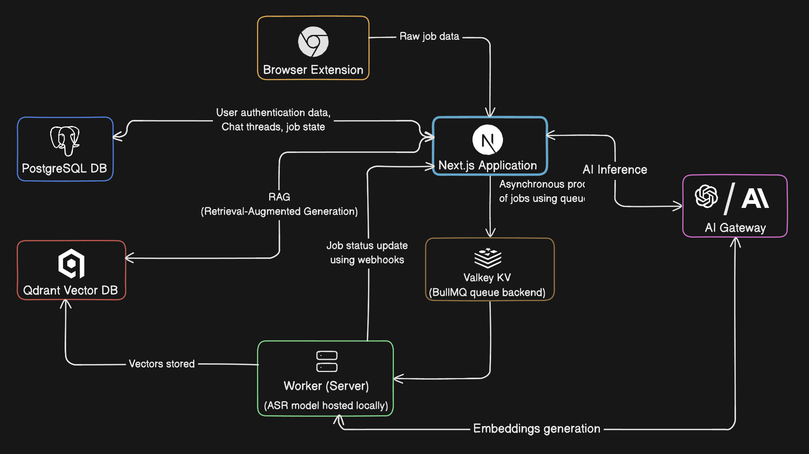

<p align="center">
  <a href="https://opencode.ai">
    <picture>
      <source srcset="extension/public/dark-logo.png" media="(prefers-color-scheme: dark)">
      <source srcset="extension/public/light-logo.png" media="(prefers-color-scheme: light)">
      
    </picture>
  </a>
</p>
<p align="center">Context oriented AI application.</p>

## Architecture



### Components

#### Next.js Application

The main web application that serves the user interface for chat, authentication, and user management. Built with Next.js 16, React, and Tailwind CSS. Uses Better Auth and webhooks for authentication.

#### Chrome Extension

A browser extension that provides context capture capabilities directly from web pages. Includes authentication.

#### Hono Worker

A long running worker process that handles background job processing and data processing. Utilizes queue for async operations. Runs OpenAI whisper ASR model locally to transcribe online videos and vectorize them.

#### Vector Store

A vector database which manages embeddings and similarity search for context retrieval.

#### Database

PostgreSQL database with Drizzle ORM. Stores user data, chat history, and application state.

## Technical

### Tech Stack

- **AI**: Langchain, AI SDK, Xenova (Transformer.js), Locally hosted OpenAI Whisper ASR model, Uses AI Gateway for embedding, classification, other small inferences. Uses Openrouter for main completion inference
- **Frontend**: Next.js 16, React, TypeScript, Tailwind CSS, Shadcn/ui
- **Extension**: Chrome Extension API, React, Vite
- **Backend**: Hono, Trpc, BullMQ
- **Database**: PostgreSQL, Drizzle ORM
- **Vector Store**: Qdrant Vector Database

### Key Features

- Contextualize text web content directly from web pages using browser extension.
- Contextualize online youtube videos (currently only vectorization of transcriptions is supported) directly from extension.
- Conditional RAG (Retrieval-Augmented Generation)
- Chat application with custom context selector, tool calls, custom markdown formatting.

## Notes

- Currently being developed as a personal project.
- Features like live voice AI responses, multimodality in chat, MCP implementation, in-extension generation, collections for classifying the jobs are on the roadmap.

## Local Setup

### Prerequisites

- Node.js 18+
- npm
- Docker (for local databases)
- API Keys of inference providers/tools services (Currently being used: AI Gateway, Openrouter, Tavily search)

### Installation

```bash
# Clone the repository
git clone https://github.com/anirudhaxe/opencontext.git
cd opencontext

# Install dependencies in /extension, /hono-worker, /next-app
cd extension && npm install
cd hono-worker && npm install
cd next-app && npm install

# Set up environment variables (Add secrets here)
cp extension/.env.example extension/.env
cp hono-worker/.env.example hono-worker/.env
cp next-app/.env.example next-app/.env

# Start local PostgreSQL database
npm run db:run

# Start local Valkey instance and local qdrant instance
npm run docker:up

# Run database migrations
cd next-app && npm run db:push

# Start development servers
# Terminal 1: Next.js app
cd next-app && npm run dev

# Terminal 2: Hono worker
cd hono-worker && npm run dev

# Terminal 3: Chrome extension
cd extension && npm run dev
```

## References

- [AI SDK](https://ai-sdk.dev/)
- [Transformer.js](https://huggingface.co/docs/transformers.js/en/index)
- [Qdrant](https://qdrant.tech/)
- [OpenRouter](https://openrouter.ai/)
- [AI Gateway](https://vercel.com/ai-gateway)
- [Next.js](https://nextjs.org/)
- [tRPC](https://trpc.io/)
- [Hono](https://hono.dev/)
- [BullMQ](https://bullmq.io/)
- [Drizzle](https://orm.drizzle.team/)
- [Shadcn/ui](https://ui.shadcn.com/)
- [CRXJS](https://crxjs.dev/)

## License

Apache 2.0
